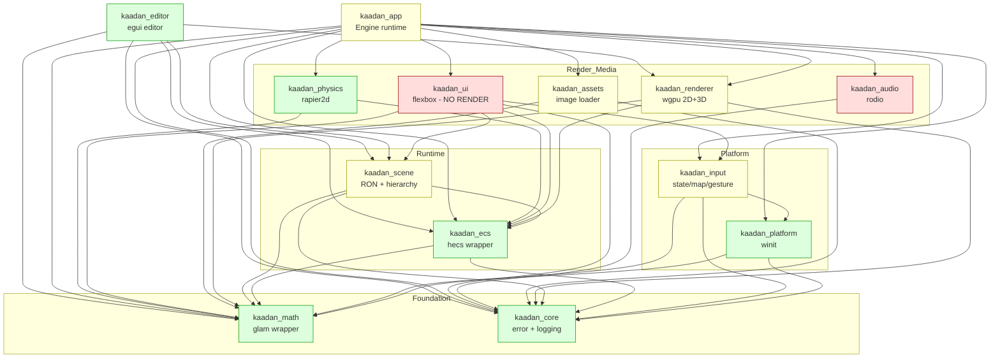

# KaadanEngine — Current State Report

> **Audit date:** 2026-05-29
> **Method:** Recursive read of every `.rs` source file, all `Cargo.toml` manifests, shaders, and build/platform infra, fanned out across parallel sub-agents (one per crate / crate-group). This report is evidence-based; file:line citations point to the source as of the `feature/3d-rendering` branch.
>
> **Scope clarification (2026-05-29):** The **editor is a desktop application** (Linux/macOS/Windows). **Games built with the engine ship to Android + iOS** (and run on desktop during development). **HarmonyOS/HyperOS is not a target.** Where this report says "mobile-first framing is aspirational," read it as: the *game runtime's* mobile deployment path is unbuilt — the desktop editor + runtime are the working foundation.

---

## 1. Executive Summary

KaadanEngine is a **modular Rust game-engine workspace** (13 crates) plus a **standalone egui-based editor**. It is currently a **desktop-only** engine: it compiles, runs a real 3D+2D demo, and the editor renders the live scene into its viewport with working hierarchy/inspector/gizmo/undo/scene-I/O. The "mobile-first" framing in the README is **aspirational** — there are no Android/iOS code paths, no mobile app entry points, and the mobile build scripts cannot yet produce a loadable artifact.

**What genuinely works (desktop):**
- 2D sprite pipeline (batched, culled, sorted) — solid and tested.
- 3D forward pipeline with directional + up-to-4 point lights, rendering lit meshes.
- ECS (thin `hecs` wrapper) with a sequential scheduler, resources, and frame timing.
- 2D physics (`rapier2d`) genuinely stepping and syncing transforms.
- Asset loading for images (PNG/JPEG), synchronous.
- The editor: render-to-texture viewport, panels, transform gizmos, undo/redo for structural ops, RON scene save/load.

**What is scaffolding, partial, or absent:**
- **Mobile (Android/iOS/HarmonyOS):** absent. No `android_main`/iOS entry, wrong crate-type, `platform::run` is hardcoded to desktop. HarmonyOS not addressed at all.
- **Scripting / integrated code editor:** entirely absent.
- **"PBR":** the 3D shader is Blinn-Phong, not metallic-roughness PBR; glTF imports geometry but drops textures.
- **In-game UI (`kaadan_ui`):** layout/interaction logic exists and is tested, but it **renders nothing** and is never registered in the engine loop.
- **Asset hot-reload, async loading, audio↔asset wiring:** modeled but not connected.
- **Frame pacing & mobile lifecycle:** implemented as logic but not enforced/wired in the loop.
- **CI:** none.

---

## 2. Repository Layout

```
KaadanEngine/
├── Cargo.toml                  # workspace root (13 members, shared deps, lints, release profile)
├── Cargo.lock                  # committed
├── README.md                   # claims Android/iOS/HyperOS; architecture diagram
├── clippy.toml, rustfmt.toml, deny.toml   # tooling configured
├── .cargo/config.toml          # Android NDK linkers + iOS rustflags + aliases
├── assets/
│   └── shaders/                # sprite.wgsl, basic.wgsl, pbr.wgsl
├── crates/
│   ├── kaadan_math/            # linear algebra over glam            (working)
│   ├── kaadan_core/            # errors + logging                    (working)
│   ├── kaadan_platform/        # winit windowing/lifecycle           (working, desktop-only)
│   ├── kaadan_input/           # input state, action map, gestures   (working, desktop-only)
│   ├── kaadan_renderer/        # wgpu 2D + 3D rendering               (working, partial 3D)
│   ├── kaadan_ecs/             # hecs wrapper + app/schedule/time     (working)
│   ├── kaadan_scene/           # RON scene model + hierarchy          (working, not bridged to World)
│   ├── kaadan_assets/          # image loading + cache + hot-reload   (working core, partial)
│   ├── kaadan_audio/           # rodio playback                       (working, unwired)
│   ├── kaadan_ui/              # in-game flexbox UI                   (logic only, NO rendering)
│   ├── kaadan_physics/         # rapier2d integration                 (working, no lifecycle cleanup)
│   ├── kaadan_app/             # engine runtime, ties crates together (working, desktop)
│   └── kaadan_editor/          # standalone egui editor               (working, most active)
├── mobile/
│   ├── android/                # AndroidManifest.xml, build.gradle.kts (placeholder scaffold)
│   └── ios/                    # Info.plist                            (placeholder scaffold)
├── scripts/                    # build_android.sh, build_ios.sh        (scaffold, won't ship)
└── examples/                   # .gitkeep only
```

**Approx. size:** ~9.7k LOC of Rust across crates. Largest: `kaadan_editor` (~2.3k LOC, 14 files), `kaadan_renderer` (~2.0k LOC, 18 files).

---

## 3. Architectural Style

- **ECS-first**, built on **`hecs` 0.10** (not bevy_ecs, not custom storage). `kaadan_ecs::World` is a thin wrapper that re-exports hecs types; components are plain structs queried via `world.query::<(&A, &B)>()`.
- **No scene graph in the renderer** — hierarchy is modeled as `Parent`/`Children`/`GlobalTransform` hecs components in `kaadan_scene`, with a transform-propagation system (currently single-level only).
- **Renderer:** **wgpu 23** directly (no custom RHI abstraction layer). `Backends::all()` auto-selects Vulkan/Metal/DX12/GL. Device limits use the conservative `downlevel_webgl2_defaults` profile — a good baseline for weak mobile GPUs.
- **Two separate runtimes:** `kaadan_app::Engine` (the game runtime, drives winit + render loop) and `kaadan_editor::EditorApp` (its **own** winit + egui-wgpu loop). The editor does **not** use `kaadan_app::Engine`; it owns its own ECS world and render passes, and reimplements scene serialization separately from `kaadan_scene`.
- **Plugin pattern:** `kaadan_ecs::Plugin` trait exists; `kaadan_physics::PhysicsPlugin` is the only real user.

---

## 4. Dependency Diagram



> **Note on `kaadan_app` edges:** it *declares* deps on `audio`, `assets`, `scene`, `physics`, and `ui`, but its engine loop does **not** actually drive them (re-exported for convenience only). The editor links `renderer/ecs/scene` and uses the **real engine component types**, but runs its own loop.

---

## 5. Per-Crate Detail

### 5.1 `kaadan_math` — *working*
TRS `Transform`, linear `Color` (GPU-ready `Pod`/`Zeroable`, correct sRGB decode), generational `Handle<T>` + `HandleAllocator`, `Rect`/`AABB`, curated re-export of glam types so downstream never imports glam directly. **8 tests.**
- **Risk:** `serde` feature is declared in Cargo.toml but **no source gates on it** — non-functional config. No serialization despite the wiring.

### 5.2 `kaadan_core` — *working*
`KaadanError` (`thiserror`, 7 variants incl. `Io`), `KaadanResult`, `init_logging()` (tracing-subscriber + EnvFilter). Re-exports `tracing`. **2 tests.**
- **Risks:** declares `kaadan_math` dependency but **never uses it** (dead dep). `init_logging()` uses `.init()` which **panics if called twice** (e.g., editor + app); no `try_init` guard.

### 5.3 `kaadan_platform` — *working, desktop-only*
Real winit `ApplicationHandler` impl. Traits `AppHandler` + `PlatformWindow` abstract the platform; exposes raw window/display handles for wgpu. **No tests.**
- **Risks:** **Android/iOS modules absent** — `run()` unconditionally calls `desktop::run` (lib.rs:13-15) despite mobile doc claims. `MouseInput` events always emit `position: Vec2::ZERO` (the "fill from last CursorMoved" is unimplemented, desktop.rs:136-141) — button clicks report (0,0). Touch is desktop mouse simulated (`id: 0` hardcoded). Several `.expect()` panics in setup. `LifecycleEvent::LowMemory` never emitted.

### 5.4 `kaadan_input` — *working, desktop-only*
Per-frame `InputState` (edge-tracked keys, touch tracking), `InputMap`/`InputBinding` actions, `GestureRecognizer` (tap/double-tap/swipe). **4 tests.**
- **Risks:** **Gamepad not implemented** — `gilrs` declared (non-mobile) but never imported; `GamepadButton`/`GamepadAxis` bindings inert. `Gesture::Pinch` + several gesture bindings are **unreachable** in `action_pressed` (fall through `_ => false`). Gesture timing uses `Instant::now()` (won't suit platforms lacking it; ignores event timestamps).

### 5.5 `kaadan_renderer` — *working, 3D partial*
**wgpu 23.** `Renderer` owns device/queue/surface/depth; init via `pollster`. Conservative `downlevel_webgl2_defaults` limits, no extra features requested → mobile-friendly baseline. **~2 tests** (sprite batch).
- **2D (solid):** `Sprite`+`Transform` → `SpriteBatch::collect` (ECS query, stable sort by z/texture, **AABB cull**, texture-merge into draw calls) → `SpriteRenderer` (growable buffers, per-texture bind-group cache). Real batching (not GPU instancing). Manual atlas UV regions.
- **3D (partial):** `PbrRenderer` queries `(Mesh3D, Transform, PbrMaterial)`, gathers 1 directional + ≤4 point lights. **Lighting is Blinn-Phong, not PBR** (`pbr.wgsl`: Lambert + Blinn-Phong, metallic stored-but-unused). glTF import parses positions/normals/uv/tangents/factors but **drops all textures** (`gltf_loader.rs:23,81`). `create_cube_mesh` fallback primitive.
- **Render-to-texture:** `RenderTarget` (color+depth, `TEXTURE_BINDING`) — **this is the editor viewport path and is fully wired** (editor `register_native_texture`).
- **Risks / dead code:** `Mesh` + `create_basic_pipeline` + `basic.wgsl` form a **complete-but-unused** path. PBR **allocates model+material uniform buffers + 2 bind groups per entity per frame** (perf risk at scale). Sampler is `mag=Nearest, min=Linear` with **no mipmaps** (aliasing on minified textures). `caps.formats[0]` indexed without bounds check.

### 5.6 `kaadan_ecs` — *working*
Thin `hecs` wrapper: `World`, `App` (+`Plugin` trait), `Schedule` (Vec of boxed `FnMut(&mut World, &mut Resources)`, **single-threaded, insertion order**), type-erased `Resources`, `Time` (variable dt). **6 tests.**
- **Risks:** doc claims "parallel system execution" but the scheduler is **strictly sequential** (misleading). No stages/ordering/labels. **No fixed timestep** despite physics needing one.

### 5.7 `kaadan_scene` — *working, not bridged to World*
RON-serializable `Scene`/`EntityDesc`/`TransformDesc` (`to_ron`/`from_ron`), `Parent`/`Children`/`GlobalTransform` hecs components, `set_parent`, `transform_propagation_system`. **1 test.**
- **Risks:** **transform propagation is single-level only** — grandchildren won't propagate correctly without topological ordering (hierarchy.rs:42-86). **No Scene↔World bridge** (serialized model is disconnected from the live ECS), **no disk save/load** (only string ser/de). Propagation silently skips entities lacking a `GlobalTransform`.

### 5.8 `kaadan_assets` — *working core, partial*
Handle-based, path-deduped asset pipeline: `AssetServer` (type-erased per-type `AssetStorage<T>`), `AssetLoader` trait, `ImageLoader` (PNG/JPEG→RGBA8), `AssetResolver`/`FilesystemResolver`, `AssetGroup` progress, feature-gated `HotReloader`. **6 tests.**
- **Risks:** **loading is fully synchronous** — `LoadState::{Queued,Loading}` are **never assigned** (dead variants implying an unbuilt async design). **HotReloader is orphaned** — it reports changed paths but nothing re-invokes loaders / invalidates storages. **Images only** — no glTF, no audio, no text/scene loaders. Cache is purely in-memory (no on-disk processed artifacts).

### 5.9 `kaadan_audio` — *working, unwired*
`rodio`-backed `AudioEngine`: one-shot SFX, looping/non-looping music, master/music/sfx volumes. **1 device-tolerant test.**
- **Risks:** **not wired to the asset system** (takes raw `Vec<u8>`; no `AudioAsset`/`AudioLoader`). `set_sfx_volume` doesn't update already-playing SFX sinks. No spatial/3D audio, no fade, no streaming (loads full file into memory). `kaadan_math` + `tracing` are declared-but-unused deps.

### 5.10 `kaadan_ui` — *logic only, NO rendering*
**Retained-mode** ECS UI: `UiNode` + style enums, `ui_layout_system` (simplified flexbox: main/cross axis, justify/align, padding/margins, safe-area), `ui_interaction_system` (hit-test + button states), widgets (`UiText`/`UiButton`/`UiImage`/`UiProgressBar`), `FontAtlas` (real `fontdue` rasterization + caching). **2 tests.**
- **Biggest functional gap in the engine:** **the UI draws nothing.** No system consumes `computed_rect`/`background`/glyphs; `FontAtlas` bitmaps are never uploaded to a GPU texture. The layout/interaction systems are **never registered** in the app loop (only `UiScreen` sizing is used). No flex-grow/shrink/wrap, no content-based sizing, no z-order/clipping.

### 5.11 `kaadan_physics` — *working, no lifecycle cleanup*
**Genuinely integrated `rapier2d`.** `PhysicsWorld::step` drives the real Rapier pipeline (broad/narrow phase, CCD, joints, query pipeline, collision-event channel mapped back to entities). `PhysicsPlugin` registers sync→step→writeback systems; lazily creates bodies/colliders; writes back dynamic-body transforms + velocity. **1 test.**
- **Risks:** **one-way sync** — reads `Transform` only at creation, never updates Rapier from later ECS edits (can't drive kinematic bodies from ECS). Writeback **dynamic-only**. **No despawn handling** — destroyed entities **leak** Rapier bodies + stale map entries. `parry2d`/`kaadan_core`/`tracing` declared-but-unused. **2D only** (no 3D physics).

### 5.12 `kaadan_app` — *working, desktop*
The runtime. `Engine` implements `AppHandler`; builder API (`on_init`/`add_system`/`insert_resource`/`with_clear_color`). `init` creates renderers + camera/UI resources; `update` paces → processes input → `app.tick()` → renders (3D PBR pass + 2D sprite overlay). `EngineSetup` asset helpers. `FramePacer`/`ThermalState`/`FrameStats`, `LifecycleManager`. **`examples/demo.rs` compiles & runs** (spinning lit cube + HUD grid + movable player sprite). **3 tests.**
- **Risks:** **frame pacer unenforced** — `end_frame()` return value never consumed; throttling relies on vsync. **Lifecycle unwired** — `LifecycleManager` never instantiated; suspend/resume surface handling absent. **Subsystems not driven** — audio/assets/scene/physics are deps but not integrated into the loop. **Mobile won't build** (see §6). No CI.

### 5.13 `kaadan_editor` — *working, most active*
Standalone Unity-style editor: **raw winit + manual egui-wgpu** (not eframe). Lazy GPU init on `resumed`. Live **render-to-texture viewport** (owns its own ECS world + `SpriteRenderer`/`PbrRenderer`/`RenderTarget`, composited into an egui `Image`). Panels: hierarchy (entity tree + CRUD), inspector (edits **real engine components** live: Transform/Sprite/Mesh3D/PbrMaterial/lights), toolbar (File/Edit/gizmo-mode/Play-Stop). Hand-rolled transform **gizmos** with click-picking (unit-tested math). **Undo/redo** for create/delete/duplicate (snapshot-based). RON **scene I/O** (own format). Minimal **play mode** (spins meshes — not a real runtime). **~8 tests** (commands 3, gizmo 4, scene_io 1).
- **Risks:** **No integrated code editor / scripting** — entirely absent (the headline roadmap item is unstarted). **Property edits not undoable** (only structural ops). Scene path **hardcoded** to `kaadan_scene.ron` (no file dialog). glTF import falls back to a cube; texture decode failures fall back to magenta 1×1. **Component set hard-enumerated in 3 places** (commands `EntitySnapshot`, `scene_io::EntityDesc`, inspector) — adding a component means editing all three (no reflection). **Editor reimplements scene serialization** separately from `kaadan_scene` (drift risk). Axis-rotate gizmo is a no-op (only free-rotate). No docking, multi-select, or add/remove-component UI.

---

## 6. Mobile & Build Infrastructure

| Item | State |
|---|---|
| `.cargo/config.toml` | **Real** — defines Android NDK linkers (3 targets) + iOS rustflags (2 targets) + aliases. Cross-compiling *individual crates* would work. |
| `scripts/build_android.sh` | Scaffold — runs `cargo ndk` for 2 targets; self-notes it needs an `android_main`. |
| `scripts/build_ios.sh` | Scaffold — runs `cargo build --target`; needs an iOS entry point. |
| `mobile/android/` (manifest + gradle) | Plausible NativeActivity scaffold (arm64/v7a), but jniLibs path + signing commented out. |
| `mobile/ios/Info.plist` | Minimal placeholder. |
| **App entry points** | **MISSING** — no `android_main`, no iOS entry anywhere. |
| **Crate-type** | **WRONG** — `kaadan_app` declares no `crate-type`, so it builds only an `rlib`. Android needs `cdylib`, iOS needs `staticlib`. |
| `platform::run` | **Desktop-only** — no `cfg(target_os)` gating; mobile backends don't exist. |
| **HarmonyOS** | **Not addressed at all** — no config, no docs, no scripts. |
| **CI** | **None** — no `.github/`, no workflows. Tooling configs (clippy/rustfmt/deny) exist but aren't enforced automatically. |

**Conclusion:** mobile is *aspirational scaffolding*. The cross-compile plumbing exists, but no loadable mobile artifact can be produced today.

---

## 7. Cross-Cutting Gaps, Dead Code & Risks

**Highest-impact gaps (block the stated MVP goals):**
1. **No scripting layer / integrated code editor** — the defining feature of a "Unity-like editor with Rust scripting" is entirely unstarted.
2. **Mobile targets non-functional** — wrong crate-type, no entry points, desktop-only `platform::run`; HarmonyOS untouched.
3. ~~**In-game UI renders nothing** — `kaadan_ui` is logic-only and unregistered.~~ **Mostly fixed in Phase 3**: a `UiRenderer` draws node backgrounds + progress bars as screen-space quads, and layout/interaction systems are registered in the engine. **Remaining:** text glyph rendering (blocked on a bundled font asset).
4. **Editor ↔ engine divergence** — editor owns a parallel scene format and its own loop; risk of two engines drifting.

**Correctness risks:**
- ~~Transform propagation is single-level (grandchildren break).~~ **Fixed in Phase 2** (recursive, any depth).
- Physics leaks bodies on entity despawn; sync is one-way (no kinematic control from ECS).
- ~~`init_logging()` panics if called twice~~ **Fixed in Phase 1** (`try_init`).
- `MouseInput` reports (0,0) position on desktop. *(Slated for Phase 9.)*
- glTF import drops textures; "PBR" is Blinn-Phong. *(Slated for Phase 4.)*

**Performance risks (matter for the mobile/perf goal):**
- PBR allocates per-entity uniform buffers + bind groups **every frame**. *(Slated for Phase 4.)*
- ~~No mipmaps + Nearest/Linear sampler mismatch → texture aliasing.~~ **Fixed in Phase 3** (full mip chain generated on upload; trilinear sampler).
- Frame pacer computes a budget but never enforces it.
- Asset loading is fully synchronous (no async/streaming).

**Dead / unused code & deps:**
- `Mesh` + `create_basic_pipeline` + `basic.wgsl` (unused colored-geometry path).
- `LoadState::{Queued,Loading}` (never assigned).
- `HotReloader` (orphaned — reports paths, reloads nothing).
- ~~Unused declared deps: `kaadan_math` in core & audio, `tracing` in audio/ui/physics, `parry2d` in physics, `serde` feature in math.~~ **Fixed in Phase 1.**
- Gamepad bindings + `gilrs` (declared, never used); several gesture bindings unreachable.
- `FrameStats` render counters never populated.

**Good news:** **no `todo!()`/`unimplemented!()`/`FIXME` anywhere** in the codebase — what exists is real, compiling code, not panicking stubs. The crates are individually coherent and self-tested.

---

## 8. Test Inventory

| Crate | Tests | Coverage notes |
|---|---|---|
| kaadan_math | 8 | transform, color sRGB, rect/AABB, handle generations |
| kaadan_core | 2 | error Display + `?` conversion |
| kaadan_ecs | 6 | spawn/query/despawn, resources, app tick |
| kaadan_input | 4 | tap, swipe, action binding |
| kaadan_assets | 6 | storage, server load/dedup/fail, group |
| kaadan_renderer | ~2 | sprite batch |
| kaadan_scene | 1 | RON roundtrip |
| kaadan_ui | 2 | layout, interaction |
| kaadan_physics | 1 | gravity fall |
| kaadan_audio | 1 | volume setters (device-tolerant) |
| kaadan_app | 3 | frame pacer, lifecycle state |
| kaadan_editor | ~8 | commands (3), gizmo (4), scene_io (1) |
| kaadan_platform | 0 | none |
| **Total** | **~44** | Happy-path unit tests; no integration tests, no GPU/render tests. |

*(Build/test verification was run during this audit; results appended in §9.)*

---

## 9. Build & Test Verification

Run during this audit (toolchain: `cargo 1.93.1`):

- **`cargo build --workspace`** → **PASS** (exit 0). The full desktop workspace compiles.
- **`cargo test --workspace`** → **PASS** — **44/44 tests green**, 0 failed:

| Crate | Passed |
|---|---|
| kaadan_math | 8 |
| kaadan_editor | 8 |
| kaadan_ecs | 6 |
| kaadan_assets | 6 |
| kaadan_input | 4 |
| kaadan_app | 3 |
| kaadan_renderer | 2 |
| kaadan_ui | 2 |
| kaadan_core | 2 |
| kaadan_scene | 1 |
| kaadan_physics | 1 |
| kaadan_audio | 1 |
| kaadan_platform | 0 |
| **Total** | **44** |

> Verification covered the **desktop** build only. Mobile targets were **not** built (and per §6 cannot currently produce a loadable artifact). No clippy/fmt/deny gate was run as part of this audit, and there is no CI enforcing them.

---

## 10. Roadmap Progress

- **✅ Phase 1 — Foundation Hardening & CI** (2026-05-30): GitHub Actions CI added (`.github/workflows/ci.yml`: fmt/clippy/test on Linux/macOS/Windows + `cargo deny`); `init_logging()` made idempotent (`try_init`); removed unused deps (`kaadan_math` from core & audio, `tracing` from audio/ui/physics, `parry2d`+`kaadan_core` from physics); wired `kaadan_math` `serde` feature with cfg-gated derives + roundtrip test; added `docs/conventions.md`. Workspace clippy/fmt/test all green (45 tests).
- **✅ Phase 2 — Core Runtime** (2026-05-30): `kaadan_ecs` scheduler now has ordered **stages** (`First/PreUpdate/FixedUpdate/Update/PostUpdate/Render`); `Time` gained a **fixed-timestep accumulator** (clamped, with spiral-of-death guard) and `App::tick` runs a capped fixed-update loop; added a double-buffered **`Events<T>`**; `App::add_system` stays backward-compatible (defaults to `Update`) with a new `add_system_to_stage`. `kaadan_scene` transform propagation is now **recursive (any depth)** and auto-inserts `GlobalTransform`. `kaadan_physics` systems moved to **`FixedUpdate`**. `kaadan_app::Engine` registers transform propagation in `PostUpdate` and gained `add_plugin`/`add_system_to_stage`. Corrected the false "parallel execution" doc on `kaadan_ecs` (it is deterministic single-threaded). All green (52 tests).
- **✅ Phase 3 — 2D Hardening + In-Game UI** (2026-05-30): `kaadan_renderer` now generates a full **mipmap chain** on texture upload with a trilinear sampler (was single-level + Nearest/Linear mismatch); added a runtime **`AtlasPacker`** (shelf packer); added a **`UiRenderer`** (screen-space ortho, alpha-blended colored/textured quads, built-in white texture) + `UiQuad` + `assets/shaders/ui.wgsl` / `UI_SHADER`. `kaadan_app::Engine` registers `ui_layout_system` + `ui_interaction_system` (PreUpdate) and draws UI node backgrounds + progress bars in the 2D pass; added `examples/ui_demo.rs`. **Text glyph rendering is deferred** (needs a bundled font); UI verification was compile/clippy/test only — not visually confirmed (headless). All green (57 tests).
