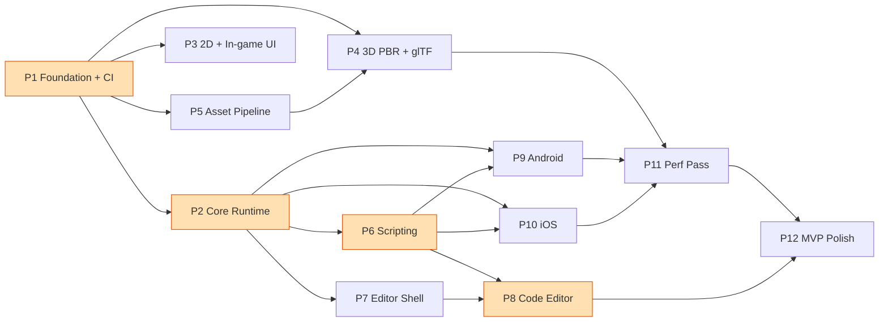

# KaadanEngine — MVP Roadmap

> **Created:** 2026-05-29 · **Companion:** [`docs/audit/CURRENT_STATE.md`](../audit/CURRENT_STATE.md)
> This roadmap is calibrated to the **actual audited state** — the repo is a working desktop engine + editor, not greenfield. Most phases **harden / complete / wire** existing code rather than build from scratch.

---

## Locked Decisions (from clarification round)

| Decision | Choice | Consequence |
|---|---|---|
| **Platform — editor** | Desktop app: **Linux / macOS / Windows** | Primary dev target; fast iteration. |
| **Platform — games** | Ship to **Android + iOS**; run on desktop for dev/play-mode | Mobile gated behind feature flags / target-cfg. |
| **HarmonyOS / HyperOS** | **Dropped** — not a target | No OpenHarmony port. (See "Out of Scope".) |
| **Renderer** | **wgpu** (keep) | Reuse existing 2D+3D pipelines. |
| **Editor UI** | **egui** (keep) | Reuse ~2.3k LOC working editor. |
| **Scripting** | **Dylib hot-reload (desktop) + static-link (mobile)** | iOS forbids loading user dylibs → mobile statically links the same gameplay crate. |

**Operating principle:** *Never break the desktop build.* Mobile code stays behind feature flags / `cfg(target_os)` until its phase. Every new module ships with a `lib.rs` doc comment, ≥1 unit test, and its ROADMAP entry marked complete. After each phase, regenerate the dependency diagram and update `CURRENT_STATE.md`.

---

## Phase Dependency Graph

**Critical path:** P1 → P2 → P6 → P8 (foundation → runtime → scripting → integrated code editor). **Parallelizable after P2:** the renderer track (P3/P4/P5), the editor track (P7), and the mobile track (P9/P10) can advance concurrently with separate sub-agents.

**Complexity legend:** S = ~1–2 days · M = ~3–5 days · L = ~1–2 weeks · XL = ~3+ weeks (single-developer-with-AI estimates; adjust to your pace).

---

## Phase 1 — Foundation Hardening & CI  ·  **S–M**

**Goal:** Clean the base so every later phase builds on solid, enforced ground.

**Reuse / Rewrite / Delete**
- *Reuse:* all crates as-is.
- *Rewrite:* `kaadan_core::logging` (`init_logging` → `try_init` guard).
- *Delete:* dead deps (`kaadan_math` in `kaadan_core` & `kaadan_audio`; unused `tracing` in audio/ui/physics; `parry2d` direct dep in physics); decide on `Mesh`/`create_basic_pipeline`/`basic.wgsl` (delete or document as intentionally-kept).

**Deliverables**
- GitHub Actions CI: `fmt --check`, `clippy -D warnings`, `test --workspace`, `cargo deny check` on Linux/macOS/Windows.
- `init_logging()` safe to call twice (editor + runtime in one process).
- Dead deps removed; `cargo machete` clean. `math` `serde` feature either wired or removed.
- `docs/conventions.md`: asset path conventions, crate-naming, feature-flag policy.

**Acceptance criteria**
- CI green on all 3 desktop OSes. `cargo clippy --workspace -- -D warnings` and `cargo fmt --check` pass. No unused-dependency warnings. 44 tests still green.

**Sub-agent tickets**
- `T1.1` Add `.github/workflows/ci.yml` (matrix: ubuntu/macos/windows; steps fmt/clippy/test/deny). Self-contained.
- `T1.2` Fix `init_logging` to use `try_init`; add a test that double-init doesn't panic.
- `T1.3` Remove dead deps from `core`, `audio`, `ui`, `physics` Cargo.tomls; verify build.
- `T1.4` Resolve `math` `serde` feature (wire derives on `Transform`/`Color`/`Rect`/`AABB` behind the feature, add a roundtrip test) — needed by P5/P7 serialization anyway.
- `T1.5` Write `docs/conventions.md`.

---

## Phase 2 — Core Runtime Completion  ·  **M–L**

**Goal:** Turn the ECS/app loop into a real runtime: ordered systems, fixed timestep for physics, an event channel, multi-level transforms, and actually drive the subsystems the engine currently only links.

**Reuse / Rewrite / Delete**
- *Reuse:* `hecs` wrapper, `Resources`, `App`, `Time` core.
- *Rewrite:* `kaadan_ecs::schedule` (add stages + ordering), `kaadan_ecs::time` (fixed-step accumulator), `kaadan_scene::hierarchy::transform_propagation_system` (topological / multi-level), `kaadan_app::engine` update loop (drive physics/scene/assets/audio/ui systems).
- *Delete:* misleading "parallel execution" doc claim (or implement rayon-parallel stages).

**Deliverables**
- `Schedule` with named **stages** (`First, PreUpdate, FixedUpdate, Update, PostUpdate, Render`) and intra-stage ordering.
- Fixed-timestep accumulator in `Time` driving a `FixedUpdate` stage (default 60 Hz) — physics runs here.
- A simple typed **event system** (`Events<T>` double-buffered resource + reader).
- `transform_propagation_system` correct for **arbitrary hierarchy depth**.
- Engine loop registers + runs: input → fixed(physics) → scene transform propagation → ui layout/interaction (post-P3) → render.

**Acceptance criteria**
- New tests: deep-hierarchy (grandchild) transform propagation; fixed-step runs N times for a given elapsed dt; event write/read across frames; stage ordering. Physics determinism test (same input → same positions) under fixed step. Demo still runs.

**Sub-agent tickets**
- `T2.1` Implement stages + ordering in `schedule.rs` (keep `FnMut(&mut World, &mut Resources)` system sig). Tests for ordering.
- `T2.2` Add fixed-timestep accumulator to `time.rs` + `App` running a `FixedUpdate` stage. Test.
- `T2.3` Add `Events<T>` resource (double-buffer, `send`/`drain`/reader cursor). Test.
- `T2.4` Rewrite `transform_propagation_system` to topo-order (or iterative dirty-propagation). Grandchild test. *(Depends on understanding `kaadan_scene` hierarchy — give agent that file.)*
- `T2.5` Wire `kaadan_app::engine` to register physics (FixedUpdate), transform propagation, and run them each frame. Integration smoke test.

---

## Phase 3 — 2D Renderer Hardening + In-Game UI Rendering  ·  **M–L**

**Goal:** Polish the (already solid) 2D path and close the biggest functional gap — `kaadan_ui` draws nothing.

**Reuse / Rewrite / Delete**
- *Reuse:* `sprite_batch`, `sprite_renderer`, `camera2d`, `atlas`, `kaadan_ui` layout/interaction/`FontAtlas`.
- *Rewrite:* `texture` sampler (fix Nearest/Linear mismatch, add mipmaps); `atlas` (add a runtime packer).
- *Add:* a UI render pass that consumes `computed_rect` + `FontAtlas` glyphs.

**Deliverables**
- Mipmap generation on texture upload; correct sampler. Optional runtime atlas packer (shelf/skyline).
- **UI rendering**: a system that turns laid-out `UiNode`/widgets into sprite/quad draw calls; `FontAtlas` glyphs uploaded to a GPU texture and drawn (text rendering). Register `ui_layout_system` + `ui_interaction_system` + new `ui_render_system` in the loop.
- Sprites can load textures via `AssetServer` (handle integration; ties to P5).

**Acceptance criteria**
- A demo screen with a button + text label **renders and responds to clicks** on desktop. Text is legible at multiple sizes. Mipmapped textures don't shimmer when minified. Sprite-batch tests still pass; add a UI-render smoke test (headless: assert draw-call count > 0 for a populated UI tree).

**Sub-agent tickets**
- `T3.1` Mipmap chain + sampler fix in `texture.rs`. Visual + unit test (mip count).
- `T3.2` `ui_render_system`: walk laid-out nodes → quads (background) + glyph quads; feed `SpriteRenderer` or a dedicated UI pass. *(Give agent `kaadan_ui/*` + `sprite_renderer.rs`.)*
- `T3.3` `FontAtlas` → GPU texture upload + glyph UV regions. Test.
- `T3.4` Runtime texture atlas packer in `atlas.rs`. Test.
- `T3.5` Wire UI systems into engine loop; example UI screen in `kaadan_app/examples/`.

---

## Phase 4 — 3D Renderer: Real PBR + glTF Textures  ·  **L**

**Goal:** Make the 3D path live up to "PBR" and import textured glTF; remove per-frame allocations.

**Reuse / Rewrite / Delete**
- *Reuse:* `pbr_renderer` structure, `mesh3d`, `material`, `camera3d`, `RenderTarget`.
- *Rewrite:* `assets/shaders/pbr.wgsl` (Blinn-Phong → Cook-Torrance metallic-roughness); `gltf_loader` (load & bind base-color / metallic-roughness / normal / emissive textures); `pbr_renderer` uniform strategy (dynamic uniform buffer or persistent per-entity bind groups — kill per-frame buffer/bind-group creation).
- *Delete:* unused `metallic_roughness_texture`/`normal_texture` dead fields become live.

**Deliverables**
- Metallic-roughness PBR shader (GGX/Cook-Torrance, Fresnel, normal mapping, emissive). Mobile shader variant (reduced lights / no normal-map path) selectable.
- glTF import wires textures into `PbrMaterial`; loads via `AssetServer` (P5).
- Per-entity GPU data via a growable dynamic uniform buffer; no allocation in steady-state render.
- Optional: simple IBL/ambient cubemap (stretch).

**Acceptance criteria**
- A textured glTF model (e.g., a known sample like a helmet) renders with correct albedo/metallic/roughness/normal/emissive on desktop. Frame allocations in the 3D pass ≈ 0 (verify via a counter/allocator test or puffin). Existing renderer tests pass.

**Sub-agent tickets**
- `T4.1` Rewrite `pbr.wgsl` to Cook-Torrance metallic-roughness + normal mapping + emissive. Document bind-group layout.
- `T4.2` `gltf_loader`: load images, create `Texture`s, populate material texture handles. Test against a sample .glb.
- `T4.3` Refactor `pbr_renderer` to dynamic uniform buffers + persistent bind groups (no per-frame alloc). Bench/counter test.
- `T4.4` Mobile shader variant + feature/quality toggle.

---

## Phase 5 — Asset Pipeline: Async + Hot-Reload + Formats  ·  **M–L**

**Goal:** Real async loading, working hot-reload, more formats, GPU-upload integration. (Can run parallel to P3/P4; P4 glTF textures consume it.)

**Reuse / Rewrite / Delete**
- *Reuse:* `AssetServer`, `AssetStorage`, `AssetResolver`/`FilesystemResolver`, `AssetGroup`, `HotReloader`.
- *Rewrite:* `server` load path → async (background thread pool or `tokio`); set `LoadState::{Queued,Loading}` properly; wire `HotReloader` to re-invoke loaders + bump handles.
- *Add:* glTF loader, audio loader (feeds `kaadan_audio`), optional on-disk processed cache.

**Deliverables**
- Async load API (`load` returns immediately with a handle in `Queued`; background worker decodes; state transitions to `Loaded`/`Failed`). Frame-safe polling.
- Hot-reload: editing a watched asset re-decodes and updates the live handle (textures re-upload to GPU).
- Loaders for glTF + audio (WAV/OGG); image loader integrated with GPU `Texture` upload.
- Optional processed-cache directory for expensive imports.

**Acceptance criteria**
- Loading 100 textures doesn't block the frame (FPS stays smooth). Editing a PNG on disk updates the rendered sprite within ~1s without restart. Audio plays via `AssetServer::load` → `AudioEngine`. New tests: async state transitions, hot-reload invalidation, glTF/audio loader happy + fail paths.

**Sub-agent tickets**
- `T5.1` Async load worker + `LoadState` transitions in `server.rs`/`storage.rs`. Tests.
- `T5.2` Wire `HotReloader` → loader re-invoke + handle update + GPU re-upload hook. Test (simulate file change).
- `T5.3` `GltfLoader` (uses `kaadan_renderer::gltf_loader`); register in server. Test with sample .glb.
- `T5.4` `AudioLoader` producing decodable buffers for `kaadan_audio`; wire `play_sound`/`play_music` to handles. Test.
- `T5.5` (Stretch) On-disk processed cache with content hashing.

---

## Phase 6 — Scripting: Dylib Hot-Reload (Desktop) + Static (Mobile)  ·  **XL**

**Goal:** Let users write gameplay in Rust, hot-reloaded on desktop, static-linked on mobile. This is the defining feature and the riskiest phase.

**Reuse / Rewrite / Delete**
- *Reuse:* ECS, `Plugin` trait, `Events`, scheduler stages.
- *New crates:* `kaadan_script` (host loader + stable plugin ABI + `ScriptContext` safe API), `templates/game_template` (a user gameplay crate that builds as `cdylib` on desktop / `rlib` for static mobile link).

**Design notes**
- Define a **stable C-ABI entry symbol** (e.g., `kaadan_plugin_register`) the host resolves via `libloading`. Avoid passing Rust generics/`std` types across the boundary — pass a `&mut ScriptContext` (a `#[repr(C)]`-safe vtable / opaque handle) exposing `world()`, `resources()`, `input()`, `time()`, event send/recv, and component registration.
- **Hot-reload loop (desktop):** watch the gameplay `target/` for a rebuilt `.so/.dylib/.dll`; on change, unload → reload → re-register systems. **State preservation:** keep `World`/`Resources` owned by the **host** (not the plugin) so data survives reload; only systems/function pointers come from the plugin. Document the unsafe boundary + the "no `static mut` in plugin" rule.
- **Mobile:** same gameplay crate compiled as a normal dependency, statically linked into the app binary; no `libloading`. A `cfg`/feature switch (`hot_reload` vs `static_link`) selects the path. Acceptance for mobile is just "the static path compiles and runs the same systems."
- **Component registration without reflection:** a `ComponentRegistry` (string name ↔ spawn/serialize/inspect fns) the plugin populates — also unblocks editor reflection (P7) and serialization (P5/P7).

**Deliverables**
- `kaadan_script` host crate: loader, ABI, `ScriptContext`, `ComponentRegistry`, reload manager.
- `game_template`: minimal "spinning cube + WASD player" gameplay crate proving register → run → hot-reload.
- Documented safety contract for plugin authors.

**Acceptance criteria**
- Desktop: edit a value in the gameplay crate, rebuild, see the change **without restarting** the host; ECS state (entity positions) **survives** reload. Mobile path: same gameplay crate compiles statically into a desktop "static" build and runs identically (proxy for mobile until P9/P10). Tests: registry register/lookup; a headless host loads a test plugin and runs one tick.

**Sub-agent tickets**
- `T6.1` Design + document the plugin ABI + safety contract (`docs/scripting/abi.md`). *(Architecture — keep in main agent; sub-agent only after design locked.)*
- `T6.2` `ComponentRegistry` (name ↔ fns for spawn/serialize/deserialize/inspect). Tests. *(Unblocks P7.)*
- `T6.3` `kaadan_script` host loader via `libloading` + reload manager (file watch → reload). Headless test plugin.
- `T6.4` `ScriptContext` safe API surface over `World`/`Resources`/`Input`/`Time`/`Events`.
- `T6.5` `templates/game_template` gameplay crate (cdylib desktop / rlib static) + build instructions.
- `T6.6` Static-link feature path + a desktop "static" build target proving the mobile model.

---

## Phase 7 — Editor Shell: Docking, Asset Browser, Unify, Reflection, Real Play  ·  **L**

**Goal:** Bring the editor up to Unity-baseline: dockable panels, asset browser, file dialogs, undoable property edits, reflection-driven inspector (no triplicated component lists), one scene format, and a play mode that runs the real runtime + scripts.

**Reuse / Rewrite / Delete**
- *Reuse:* viewport render-to-texture, gizmos, hierarchy/inspector/toolbar, undo stack.
- *Rewrite:* `scene_io` → use **`kaadan_scene`** format (remove the duplicate `EditorScene`); inspector → driven by `ComponentRegistry` (P6) instead of hand-enumerated components; `play` → run the actual `kaadan_app` runtime + script systems; route inspector/gizmo edits through the command stack.
- *Add:* `egui_dock` docking; `rfd` file dialogs; asset browser panel.
- *Delete:* triplicated component enumeration (`EntitySnapshot`, `EditorScene::EntityDesc`, inspector match arms) → single registry-driven path.

**Deliverables**
- Dockable, rearrangeable panels. Asset browser (thumbnails for textures, list for meshes/audio) backed by `AssetServer`.
- Save/Open with file dialog (no hardcoded `kaadan_scene.ron`); editor and runtime read/write the **same** `kaadan_scene` format with a `Scene ↔ World` bridge.
- Property edits + gizmo drags are **undoable**.
- Inspector auto-generates fields from `ComponentRegistry`; "Add Component" UI.
- **Play mode** spins up the real engine runtime (fixed step, systems, scripts) on the editor's world snapshot; Stop restores.

**Acceptance criteria**
- Add a component via UI, edit it, undo/redo works. Save a scene, reopen, identical. The same `.ron` loads in a standalone `kaadan_app` runtime. Press Play → scripted behavior runs in-viewport; Stop → state reverts. No component is enumerated in more than one place.

**Sub-agent tickets**
- `T7.1` `Scene ↔ World` bridge in `kaadan_scene` (spawn a `Scene` into a `World`, extract a `World` into a `Scene`) using `ComponentRegistry`. Tests. *(Depends T6.2.)*
- `T7.2` Replace editor `scene_io` with `kaadan_scene` + bridge; delete `EditorScene`. Roundtrip test.
- `T7.3` Registry-driven inspector + "Add/Remove Component". *(Depends T6.2.)*
- `T7.4` Route inspector/gizmo edits through `commands.rs` (undoable). Tests.
- `T7.5` Integrate `egui_dock` + `rfd` file dialogs.
- `T7.6` Asset browser panel backed by `AssetServer` (P5).
- `T7.7` Real play mode: embed `kaadan_app` runtime + script host in the editor world. Smoke test.

---

## Phase 8 — Integrated Code Editor + Cargo Build/Reload  ·  **L**

**Goal:** Edit gameplay Rust inside the editor, build it, and hot-reload — closing the loop with P6.

**Reuse / Rewrite / Delete**
- *Reuse:* egui editor shell (P7), script host + reload (P6).
- *Add:* a code-editing panel (`egui_code_editor` or a `syntect`-highlighted text widget), a file tree for the gameplay crate, a "Build & Reload" action invoking `cargo build` on the gameplay cdylib, and a build-output panel parsing `cargo --message-format=json` diagnostics.

**Deliverables**
- Code panel with Rust syntax highlighting, open/save, file tree of the game crate.
- "Build & Reload" button → runs `cargo build -p <game>` → on success triggers the P6 hot-reload → on failure shows parsed errors with file:line, clickable to jump to source.
- Build status/output console.
- (Stretch) `rust-analyzer` LSP integration for completion/diagnostics.

**Acceptance criteria**
- Edit gameplay code in the panel, click Build & Reload, see the change live without leaving the editor. A compile error appears in the console with a clickable location. Saving works.

**Sub-agent tickets**
- `T8.1` Code-editing panel with Rust highlighting (evaluate `egui_code_editor` vs `syntect`); open/save + file tree.
- `T8.2` `cargo build` runner (async, `--message-format=json`) + diagnostic parsing → structured errors. Test the parser on captured cargo JSON.
- `T8.3` Wire Build success → P6 reload; failure → console with clickable file:line.
- `T8.4` (Stretch) LSP client for rust-analyzer.

---

## Phase 9 — Android Deployment  ·  **L**

**Goal:** Produce a runnable Android APK of a game built with the engine. (Parallel with P10 after P2+P6.)

**Reuse / Rewrite / Delete**
- *Reuse:* `kaadan_platform` traits, `kaadan_renderer` (wgpu Vulkan/GLES), `AssetResolver` (already abstracts a future `AAssetManager`).
- *Rewrite:* `kaadan_platform::run` → `cfg(target_os="android")` path; add android module (`android-activity`/winit android backend). `kaadan_app` `Cargo.toml` → `crate-type = ["cdylib"]` for the app artifact; add `android_main`.
- *Add:* real touch/multitouch (fix the desktop (0,0) bug + map to `TouchEvent`), lifecycle suspend/resume → surface recreation, `AAssetManager`-backed resolver, packaging.

**Deliverables**
- `android_main` entry; cdylib `.so` for arm64-v8a (+ armeabi-v7a). winit/android-activity event loop. APK packaging (`cargo-apk`/`cargo-ndk` + the existing `mobile/android` gradle scaffold made real: jniLibs path, signing config).
- Surface created on `Resumed`, destroyed on `Suspended`; renderer recreates swapchain. Real multitouch + gestures. Assets loaded via AAssetManager. Gameplay **static-linked** (per scripting decision).

**Acceptance criteria**
- `./scripts/build_android.sh` produces an installable APK. The 2D and 3D demos run on a device/emulator with touch input, surviving background/foreground (no crash on resume). Static-linked gameplay runs.

**Sub-agent tickets**
- `T9.1` `kaadan_app` crate-type `cdylib` + `android_main`; `platform::run` android cfg path. Compiles for `aarch64-linux-android`.
- `T9.2` Android surface lifecycle (create/destroy on resume/suspend) + renderer swapchain recreation.
- `T9.3` Real touch/multitouch in `kaadan_platform` (fix `MouseInput` (0,0); map to `TouchEvent` with ids) — also fixes desktop.
- `T9.4` `AAssetManager` resolver impl behind `cfg(android)`.
- `T9.5` APK packaging: finalize `mobile/android` gradle + `build_android.sh`; document signing.

---

## Phase 10 — iOS Deployment  ·  **L**

**Goal:** Produce a runnable iOS app of a game built with the engine.

**Reuse / Rewrite / Delete**
- *Reuse:* platform traits, wgpu (Metal), touch work from P9.
- *Rewrite:* `platform::run` → `cfg(target_os="ios")` path (winit iOS backend); `kaadan_app` `crate-type = ["staticlib"]` for iOS; iOS entry point.
- *Add:* Xcode project / `cargo-mobile2` packaging, signing, `mobile/ios/Info.plist` finalized, lifecycle.

**Deliverables**
- iOS entry + staticlib; Metal via wgpu (MoltenVK is the fallback wgpu handles internally). winit iOS event loop, touch, lifecycle. Packaging via `cargo-mobile2` or xcodegen; signing docs. **Gameplay static-linked** (no on-device hot-reload — by design).

**Acceptance criteria**
- `./scripts/build_ios.sh` (or documented Xcode flow) builds an `.app`/`.ipa`. 2D + 3D demos run on simulator/device with touch + lifecycle. Static gameplay runs.

**Sub-agent tickets**
- `T10.1` `kaadan_app` staticlib + iOS entry; `platform::run` ios cfg path. Builds for `aarch64-apple-ios`.
- `T10.2` iOS surface/lifecycle via winit; verify Metal backend selected.
- `T10.3` Packaging (`cargo-mobile2`/xcodegen) + signing docs; finalize `Info.plist` + `build_ios.sh`.
- `T10.4` iOS touch mapping (reuse P9 `TouchEvent` model).

---

## Phase 11 — Performance Pass  ·  **M–L**

**Goal:** Hit mobile perf/memory budgets; add profiling and capture hooks.

**Reuse / Rewrite / Delete**
- *Reuse:* `puffin` (already a dep), `FramePacer`/`ThermalState`/`FrameStats`.
- *Rewrite:* engine loop to **enforce** the frame pacer (`end_frame()` currently unused); populate `FrameStats` render counters; wire `ThermalState` → adaptive FPS.
- *Add:* GPU capture hooks, memory budgets, draw-call reduction (sprite instancing), asset streaming.

**Deliverables**
- Frame profiler (puffin scopes through hot paths) + a frame/GPU stats overlay. Frame pacing actually enforced; thermal throttling adapts FPS on mobile. Draw-call reduction (true GPU instancing for sprites/repeated meshes). Memory budget tracking + asset streaming/unload. Documented per-platform budgets.

**Acceptance criteria**
- A scene with thousands of sprites holds target FPS on a mid-tier mobile device. Draw calls measurably reduced vs. pre-phase. No steady-state per-frame heap allocation in the render path (verify). Profiler overlay shows real timings. Thermal throttling demonstrably lowers FPS under load.

**Sub-agent tickets**
- `T11.1` Wire puffin scopes + enforce `FramePacer::end_frame`; populate `FrameStats`. Test counters.
- `T11.2` Sprite/mesh GPU instancing path. Bench before/after.
- `T11.3` Thermal-adaptive FPS wired into the loop (`ThermalState`). Test.
- `T11.4` Memory budget tracker + asset streaming/unload by group. Test.
- `T11.5` GPU capture hooks / RenderDoc-friendly debug markers.

---

## Phase 12 — MVP Polish  ·  **M**

**Goal:** Prove the engine with real examples and onboard new users.

**Deliverables**
- One complete **2D example game** and one **3D example game**, each buildable for desktop + Android + iOS, using scripting.
- `getting-started.md` (install toolchain, create a project from `game_template`, open in editor, build & ship to a device).
- Docs site (mdbook) covering architecture, scripting API, asset pipeline, deployment.
- A `cargo kaadan new <name>` (or script) project generator from the template.

**Acceptance criteria**
- A new user can follow getting-started, scaffold a project, edit gameplay in the integrated editor, and deploy the 2D demo to a phone. Both examples build green in CI for all targets (mobile compile-checked). Docs site builds.

**Sub-agent tickets**
- `T12.1` 2D example game (uses scripting, assets, UI, physics).
- `T12.2` 3D example game (uses PBR, glTF, scripting).
- `T12.3` Project generator from `templates/game_template`.
- `T12.4` mdbook docs site + getting-started guide.
- `T12.5` CI: add mobile **compile-check** jobs (build for android/ios targets without device).

---

## Out of Scope (for MVP)

- **HarmonyOS / OpenHarmony** — dropped per scope clarification. If revisited later, the open unknowns (OHOS NDK Vulkan/GLES + native-window + raw-window-handle support; HarmonyOS NEXT vs Android-compat; toolchain) are recorded in `CURRENT_STATE.md` history and would warrant a dedicated research spike before any commitment.
- **3D physics** — `kaadan_physics` is 2D (rapier2d) only; 3D physics (rapier3d) is post-MVP.
- **Networking / multiplayer**, **advanced rendering** (shadows beyond basic, post-processing stacks, GI), **animation system** (skeletal/skinning) — all post-MVP unless a chosen example game needs a minimal slice.
- **Console / web (wasm) targets.**

---

## Execution Rules (for build-out)

- Hand each **ticket** above to a sub-agent with only: the relevant file paths, the trait/interface it implements, and the acceptance test. Keep architecture/integration/review in the main agent.
- Every new module: `lib.rs` doc comment (intent), ≥1 unit test, ROADMAP entry marked ✅.
- Never break the desktop build. Mobile code behind `cfg(target_os)` / feature flags until its phase.
- After each phase: regenerate the dependency diagram, update `CURRENT_STATE.md`, and check the box below.

### Progress

- [x] P1 Foundation & CI ✅ (2026-05-30)
- [x] P2 Core Runtime ✅ (2026-05-30)
- [x] P3 2D + In-Game UI ✅ (2026-05-30) — *quad rendering; text glyphs deferred (needs bundled font)*
- [ ] P4 3D PBR + glTF
- [ ] P5 Asset Pipeline
- [ ] P6 Scripting
- [ ] P7 Editor Shell
- [ ] P8 Integrated Code Editor
- [ ] P9 Android
- [ ] P10 iOS
- [ ] P11 Performance
- [ ] P12 MVP Polish
